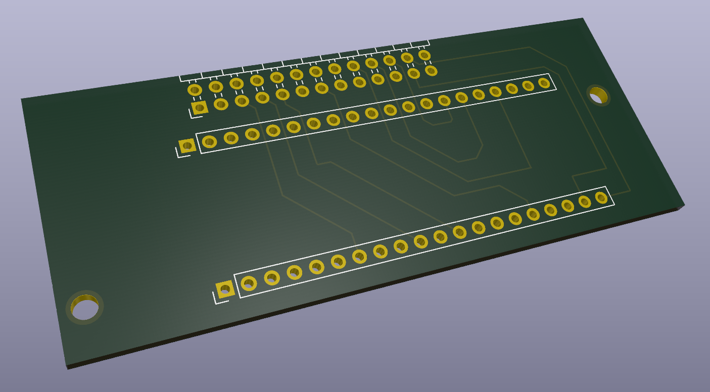
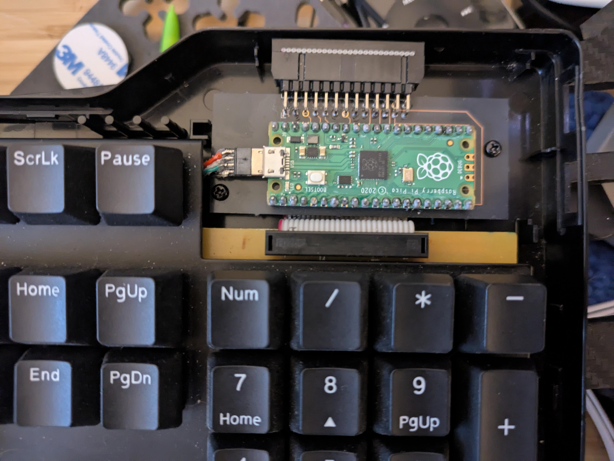

# daspico

A custom keyboard controller (with QMK firmware) for the DasKeyboard Model S Professional

## Overview

This project provides PCB designs and firmware to build a drop-in replacement keyboard controller for the DasKeyboard Model S Professional keyboard. The custom controller board connects to the keyboard's existing matrix through the original ribbon cable connector, providing modern USB connectivity and programmable functionality.

## PCB Design Files

The `board/` directory contains the complete KiCad project files for the custom controller PCB:

- **`CtrlBoard.kicad_pro`** - Main KiCad project file containing project settings and configuration
- **`CtrlBoard.kicad_sch`** - Schematic file with complete circuit design including:
  - Microcontroller (Raspberry Pi Pico/RP2040) 
  - Matrix scanning circuitry
  - USB connectivity
  - Power management
  - Ribbon cable connector interface
- **`CtrlBoard.kicad_pcb`** - PCB layout file with component placement and routing
- **`CtrlBoard.kicad_prl`** - Project local settings (layer visibility, etc.)

### Manufacturing

The PCB is designed to be manufactured by standard PCB fabrication services (I used [OSHPark](https://oshpark.com/shared_projects/ivYUztXI)). The board includes:
- Standard 1.6mm thickness
- Single-sided assembly with minimal hand-soldering required
- Plated screw holes which line up with the placement of the original controller PCB

## QMK Firmware

The `qmk_profile/` directory contains a complete QMK firmware implementation for the daspico controller.

### Building the Firmware

1. **Set up QMK development environment** following the [QMK setup guide](https://docs.qmk.fm/#/getting_started_build_tools)

2. **Copy the profile to your QMK installation:**
   ```bash
   cp -r qmk_profile/daspico /path/to/qmk_firmware/keyboards/
   ```

3. **Build the firmware:**
   ```bash
   qmk compile -kb daspico -km default
   ```

4. **Flash to your controller:**
   ```bash
   qmk flash -kb daspico -km default
   ```

### Entering Bootloader Mode

To flash new firmware, enter the bootloader in one of these ways:
- **Bootmagic reset**: Hold Escape while plugging in the USB cable
- **Physical reset**: Press the reset button on the PCB (if populated)
- **Keycode**: Press the key mapped to `QK_BOOT` if available in your keymap

### Customization

The default keymap provides standard DasKeyboard functionality. You can create custom keymaps by:
1. Copying `qmk_profile/daspico/keymaps/default/` to a new directory
2. Editing the `keymap.c` file with your desired layout
3. Building with your custom keymap: `make daspico:your_keymap_name`

## CircuitPython Firmware (Alternative)

In addition to QMK, this project includes a complete CircuitPython-based firmware implementation in `code.py`. This provides an alternative approach with easier customization and debugging capabilities.

**For complete CircuitPython setup instructions, features, and customization options, see [README.CPFirmware.md](README.CPFirmware.md)**

The CircuitPython firmware (`code.py`) offers:
- Full USB HID keyboard functionality
- Advanced matrix scanning with debouncing
- Debug console for troubleshooting
- Easier customization without compilation
- Function key combinations
- N-key rollover support

## Installation Photos

### Adapter PCB


*3D render of the daspico controller PCB showing component placement and board layout*


### Finished Installation


*Installed in a DasKeyboard Model S Professional*

## Features

- **Drop-in replacement**: Designed to fit in the original DasKeyboard controller location
- **Original connector compatibility**: Uses the existing ribbon cable connection
- **USB-C connectivity**: Modern USB interface with reliable connection
- **Programmable firmware**: Full QMK support for custom layouts and macros
- **Open source**: Complete design files and firmware source available
- **Multiple firmware options**: Choose between QMK and CircuitPython implementations

## Hardware Requirements

- Custom PCB (manufactured from provided design files)
- Raspberry Pi Pico or compatible RP2040 board
- Basic soldering skills for assembly
- DasKeyboard Model S Professional (for installation)

## Contributing

Contributions are welcome! Please feel free to:
- Submit bug reports or feature requests
- Contribute PCB design improvements
- Add new firmware features
- Share installation photos and experiences

## License

This project is licensed under the GPLv2 (same as QMK). See [LICENSE](LICENSE) for details.

## Acknowledgments

- QMK Firmware project for the excellent keyboard firmware framework
- CircuitPython and Adafruit for the alternative firmware platform
- DasKeyboard Model S Professional for creating an excellent mechanical keyboard worth upgrading
